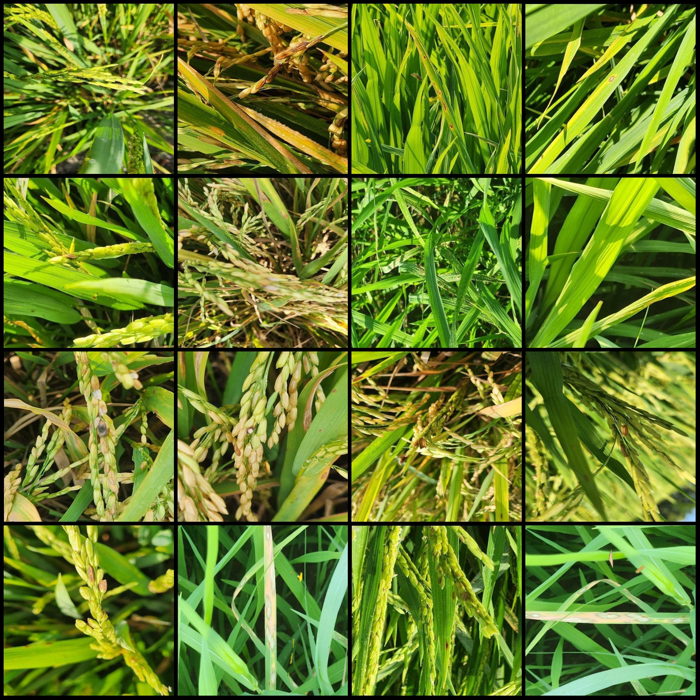
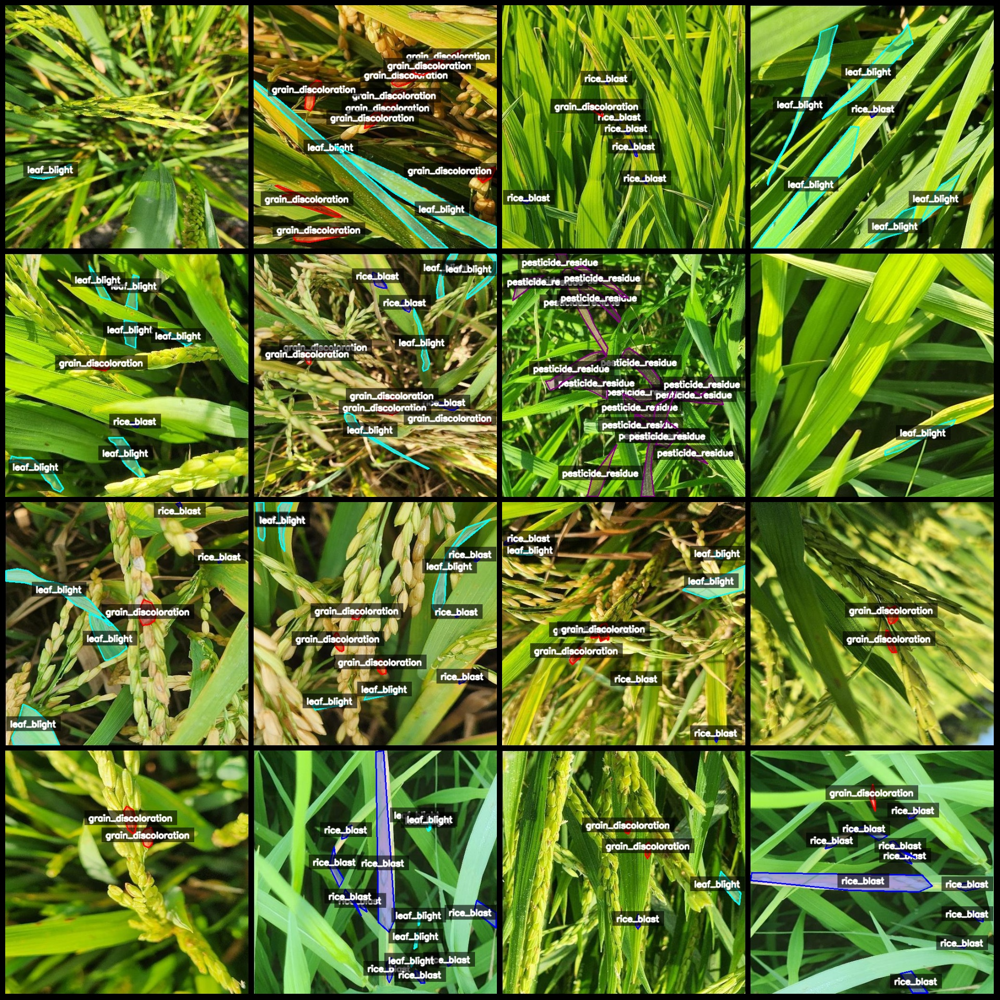
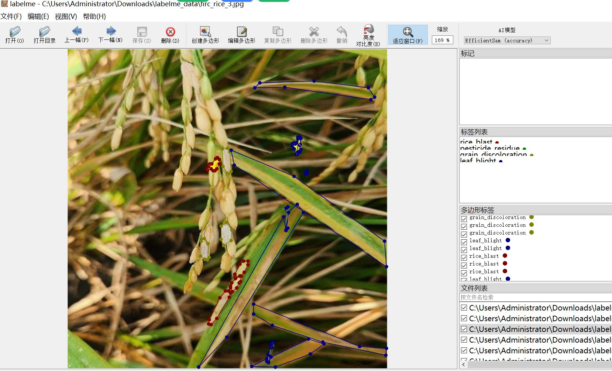

# Intelligent Agriculture Rice Pests and Disease Identification Segmentation Dataset - LabelMe Format with 1006 Categories

The dataset format is LabelMe (without mask files, only including JPG images and corresponding JSON files).

Number of images (JPG file count): 1006
Number of annotations (JSON file count): 1006
Number of categories: 4
Annotation category names: ["grain_discoloration", "leaf_blight", "pesticide_residue", "rice_blast"]
Each category has the following number of bounding boxes:
- grain_discoloration (grain color changes) count = 1854
- leaf_blight (Leaf Blight) count = 2307
- pesticide_residue (Pesticide Residue) count = 2098
- rice_blast (Rice Blast) count = 2776
Total bounding box count: 9035

Annotation tool used: labelme=5.5.0
Image resolution: 512x512
Annotation rule: Polygons are drawn around the categories
Important note: The dataset can be opened and edited using LabelMe, but the JSON dataset needs to be converted into a mask or YOLOF/COCO format for semantic segmentation or instance segmentation.
Special declaration: This dataset does not guarantee the accuracy of the trained models or weight files.

Image preview:

Annotation examples:
Randomly selected 16 images:
Annotation drawing results:

## Images

Here is a pay link on Stripe ( https://buy.stripe.com/3cs8yP7sY87d0vu9AB ). Please contact me lonlonago@foxmail.com after funding $89, and I will send you a complete data files , thank you!

